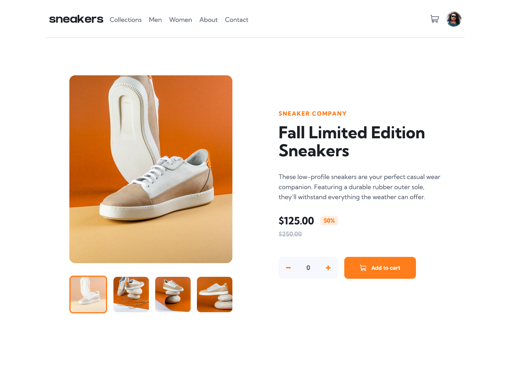

# Frontend Mentor - E-commerce product page solution

This is a solution to the [E-commerce product page challenge on Frontend Mentor](https://www.frontendmentor.io/challenges/ecommerce-product-page-UPsZ9MJp6). Frontend Mentor challenges help you improve your coding skills by building realistic projects.

## Overview

### The challenge

Users should be able to:

- View the optimal layout for the site depending on their device's screen size
- See hover states for all interactive elements on the page
- Open a lightbox gallery by clicking on the large product image
- Switch the large product image by clicking on the small thumbnail images
- Add items to the cart
- View the cart and remove items from it

### Screenshot

### Links

[Live Site](https://your-live-site-url.com)

## My process

### Built with

- [Astro](https://astro.build/) - Static site generator
- [Svelte](https://svelte.dev/) - Runtime components
- [Sass](https://sass-lang.com/) - CSS preprocessor
- Flexbox
- CSS Grid
- Mobile-first workflow

### What I learned

A whole lotta stuff... Never tried sidebars, dropdowns or floating buttons with vanilla CSS. And also learned I can share svelte stores within an astro project.

## Author

- Frontend Mentor - [@lipe11](https://www.frontendmentor.io/profile/lipe11)

## Acknowledgments

To the Frontend Mentor community. I'm just stating out here, but already grabbed a few tips from seeing other people's work.
